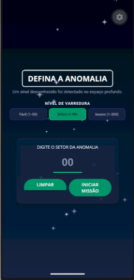
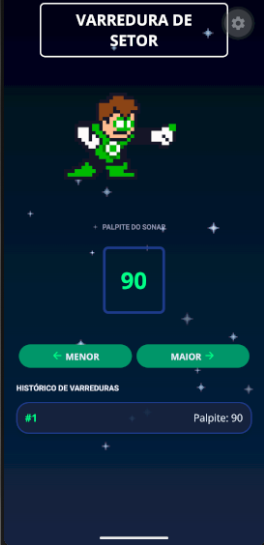

# Emerald Scan

> **Uma anomalia foi detectada em algum setor do universo. O Guardião precisa encontrá-la.**

**Emerald Scan** é um jogo mobile desenvolvido em **React Native com Expo**, inspirado no universo do **Lanterna Verde** e baseado na mecânica clássica de adivinhação de números.

O jogador escolhe secretamente um setor dentro de um determinado intervalo. A partir disso, o **Guardião do Universo** inicia uma sequência de varreduras para localizar a anomalia.

A cada tentativa, o jogador informa se o setor procurado é **maior** ou **menor** que o número apresentado. Com essas informações, o Guardião reduz progressivamente a área de busca até localizar o setor correto.

O diferencial está no uso de uma **estratégia de busca binária**, permitindo que o aplicativo encontre o setor de maneira eficiente, em vez de realizar tentativas aleatórias.

---

## Como funciona

1. O jogador escolhe o nível de dificuldade.
2. Um setor é escolhido dentro do intervalo disponível.
3. O Guardião realiza uma primeira varredura.
4. O jogador informa se o setor correto é **maior** ou **menor** que o palpite.
5. O Guardião utiliza essa informação para reduzir o espaço de busca.
6. O processo continua até que o setor seja encontrado.
7. Ao final, o desempenho da busca é avaliado e o jogador recebe uma classificação em estrelas.

---
## Screenshots

Abaixo estão algumas telas do **Emerald Scan** durante a execução do jogo.

### Tela inicial

Tela de seleção da dificuldade e início de uma nova partida.

<p align="center">
  
</p>

### Tela de jogo

Tela principal da partida, onde o Guardião realiza as varreduras e o jogador informa se o setor procurado é maior ou menor que o palpite.

<p align="center">
  
</p>

### Tela de vitória

Tela apresentada após a localização do setor, mostrando o desempenho obtido na partida.

<p align="center">
  
</p>

<p align="center">
  
</p>


---

## Sistema de Busca

O mecanismo principal do jogo utiliza o conceito de **Busca Binária (Binary Search)**.

A cada resposta do jogador, os limites da busca são atualizados:

```text
┌─────────────────────────────────────┐
│          ESPAÇO DE BUSCA            │
│                                     │
│  menor <──────────────> maior       │
│             ^                       │
│          palpite                    │
└─────────────────────────────────────┘
```

Em vez de testar todos os números individualmente, o algoritmo elimina aproximadamente metade das possibilidades a cada rodada.

Isso permite que o Guardião encontre o setor utilizando uma quantidade reduzida de tentativas.

### Validação de respostas

O jogo também mantém os limites mínimo e máximo possíveis para o setor.

Caso o jogador forneça uma resposta incompatível com o histórico anterior, o sistema identifica a inconsistência e apresenta o alerta:

> **Sinal incompatível!**

Dessa forma, uma resposta incorreta não permite que a busca continue em um intervalo impossível.

---

## Níveis de dificuldade

O jogador pode escolher entre três tamanhos de mapa:

| Dificuldade | Intervalo |
| ----------- | --------- |
| Fácil       | 1 – 50    |
| Difícil     | 1 – 99    |
| Insano      | 1 – 200   |

Quanto maior o intervalo, maior é o espaço de busca e maior pode ser a quantidade de varreduras necessárias.

---

## Sistema de desempenho

Após encontrar o setor, o jogo compara a quantidade de tentativas realizadas com o número de tentativas esperado para uma busca eficiente no intervalo utilizado.

O desempenho é convertido em uma classificação de **1 a 3 estrelas**.

O objetivo é encontrar a anomalia utilizando o menor número possível de varreduras.

---

## Recorde

O melhor desempenho de cada dificuldade é armazenado localmente no dispositivo.

O sistema utiliza **AsyncStorage** para preservar o menor número de tentativas registrado mesmo depois que o aplicativo é fechado.

---

## Recursos de imersão

O jogo utiliza recursos do dispositivo para reforçar a experiência.

### Áudio

Efeitos sonoros são utilizados durante as varreduras e na conclusão da partida.

### Feedback tátil

O **Haptics** fornece respostas por vibração durante determinadas interações, como:

* seleção das respostas;
* alertas de inconsistência;
* eventos importantes da partida.

### Histórico de varreduras

As tentativas anteriores são exibidas em uma lista rolável utilizando `FlatList`, permitindo acompanhar a evolução da busca em tempo real.

---

## Créditos e recursos

### Música

As músicas utilizadas no projeto foram obtidas através do **OpenGameArt.org**.

**1-ton_fanfare.wav**

* Autor: **Zane Little Music**
* Licença: **CC0 1.0**
* Fonte: [OpenGameArt — 1-ton_fanfare](https://opengameart.org/content/1-ton-fanfare-day-10)

**Space Cadet — space_cadet.ogg**

* Autor: **congusbongus**
* Licença: **OGA-BY 4.0 / CC-BY 4.0**
* Fonte: [OpenGameArt — Space Cadet](https://opengameart.org/content/space-cadet)

### Pixel Art

As artes em pixel utilizadas no jogo foram **criadas manualmente no Aseprite**, incluindo os sprites e elementos visuais desenvolvidos especificamente para o projeto.

---

## Estrutura

O projeto foi organizado separando telas, componentes reutilizáveis, componentes específicos do jogo, constantes, utilitários e recursos estáticos.

```text
emerald-scan
├── assets
│   ├── images
│   ├── fonts
│   └── sounds
│
├── components
│   ├── game
│   │   ├── NumberContainer.js
│   │   ├── GuessLogItem.js
│   │   ├── RingAuraAnimation.js
│   │   └── BackgroundStars.js
│   │
│   └── ui
│       ├── PrimaryButton.js
│       ├── Title.js
│       ├── InstructionText.js
│       └── Card.js
│
├── constants
│   └── Colors.js
│
├── utils
│   └── numbers.js
│
├── screens
│   ├── StartGameScreen.js
│   ├── GameScreen.js
│   └── GameOverScreen.js
│
├── App.js
├── app.json
└── package.json
```

### Principais responsabilidades

**`App.js`**
Responsável pela inicialização do aplicativo, carregamento dos recursos e gerenciamento do fluxo entre as telas.

**`StartGameScreen.js`**
Tela inicial onde o jogador escolhe a dificuldade e inicia uma partida.

**`GameScreen.js`**
Concentra a lógica principal da partida, incluindo a busca binária, atualização dos limites, validação das respostas e histórico de tentativas.

**`GameOverScreen.js`**
Apresenta o resultado da partida, desempenho, estrelas, recorde e opção para iniciar uma nova partida.

**`components/game`**
Contém componentes específicos utilizados durante a partida, como o número atual, histórico de tentativas, animação da aura do anel e fundo de estrelas.

**`components/ui`**
Contém componentes visuais reutilizáveis e elementos compartilhados da interface.

**`constants`**
Centraliza valores utilizados em diferentes partes da aplicação, como as cores da interface.

**`utils`**
Contém funções auxiliares utilizadas pela aplicação.

---

## Instalação e Execução

### Tecnologias utilizadas

* **React Native**
* **Expo**
* **JavaScript**
* **AsyncStorage**
* **Expo Haptics**
* **Expo AV**
* **FlatList**
* **React Native Components**
* **Google Fonts / fontes personalizadas**

### Pré-requisitos

- Node.js
- Android Studio (opcional)
- Expo Go

### Passo a Passo

1.  **Clone o repositório:**
    ```bash
    git clone https://github.com/Samuel-fernandesf/Emerald-Scan.git
    cd 'Emerald-Scan/app/'
    ```
2.  **Instale as dependências**
    ```bash
    npm install
    ```
3.  **Inicie o servidor do Expo:**
       ```bash
       npx expo start
       ```

       Para visualizar:
        Use o app Expo Go no seu celular e escaneie o QR Code gerado. <br>
        Ou pressione a para abrir no emulador Android ou i para iOS.


---
## Observações finais

Este projeto foi desenvolvido como trabalho avaliativo do 3º Bimestre para a disciplina de **Aplicativos Móveis**, explorando:

* criação de interfaces mobile;
* componentização;
* reutilização de componentes;
* gerenciamento de estado;
* navegação entre telas;
* interação com recursos do dispositivo;
* armazenamento local;
* reprodução de áudio;
* feedback tátil;
* listas dinâmicas;
* implementação de algoritmos;
* organização de projetos React Native.

Além da temática do Lanterna Verde, a proposta utiliza a busca binária como parte central da experiência, transformando um algoritmo clássico em uma mecânica interativa de jogo.

## Integrantes da Dupla
- [Samuel Fernandes Filho](https://github.com/Samuel-fernandesf) — Prontuário: AQ3021092    

* **Instituição:** Instituto Federal de São Paulo (**IFSP**) - Campus Araraquara
